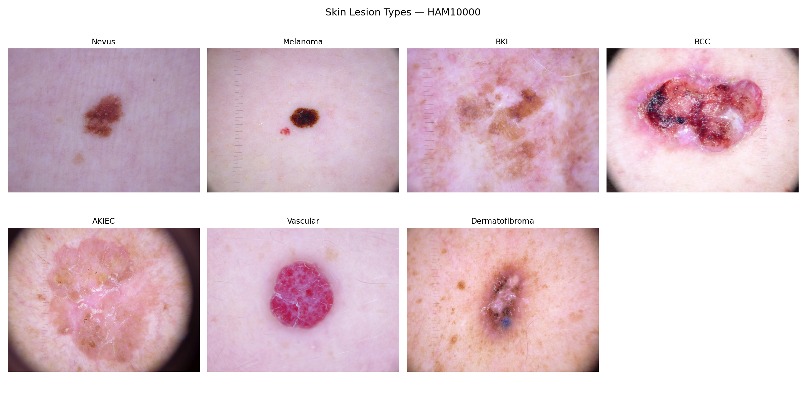
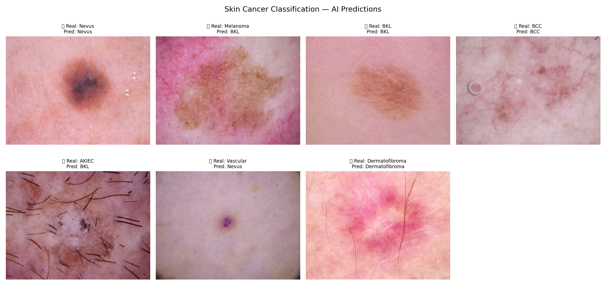
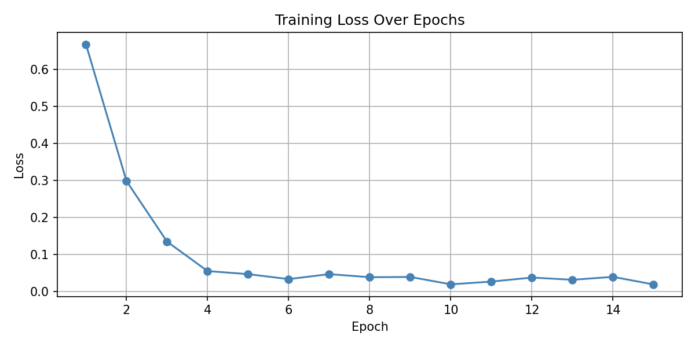

# 🔬 Skin Cancer Classification with Deep Learning

Automatically classifying skin lesions into 7 categories using 
Transfer Learning on the HAM10000 dataset.

## What this project does
Takes a skin lesion image and classifies it into one of 7 types —
from harmless moles to dangerous melanoma — mimicking what a 
dermatologist does during diagnosis.

## Dataset
HAM10000 — 10,015 real dermatoscopy images across 7 classes:
- Nevus (normal mole)
- Melanoma (dangerous skin cancer)
- Benign Keratosis (BKL)
- Basal Cell Carcinoma (BCC)
- Actinic Keratosis (AKIEC)
- Vascular Lesion
- Dermatofibroma

## Model
ResNet18 pretrained on ImageNet — fine tuned for skin lesion classification.
- Training images: 8,012
- Test images: 2,003
- Epochs: 15
- **Test Accuracy: 84.07%**

## Results
| | |
|---|---|
| Lesion Types | AI Predictions |
|  |  |

## Loss Curve

## Limitations & Next Steps
- More epochs and data augmentation would improve accuracy
- Dataset is imbalanced — melanoma is underrepresented
- Next: try EfficientNet for better accuracy

## How to run
Open the notebook in Google Colab:
1. Upload your kaggle.json
2. Run all cells in order

## Tools used
Python · PyTorch · ResNet18 · HAM10000 · NumPy · Matplotlib
